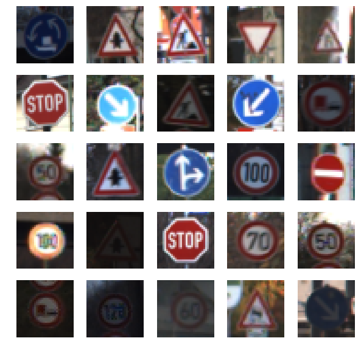
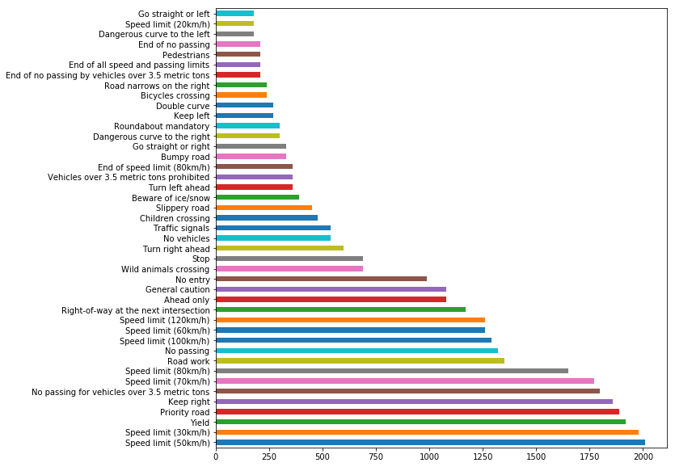
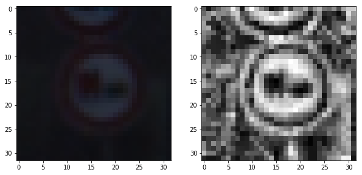
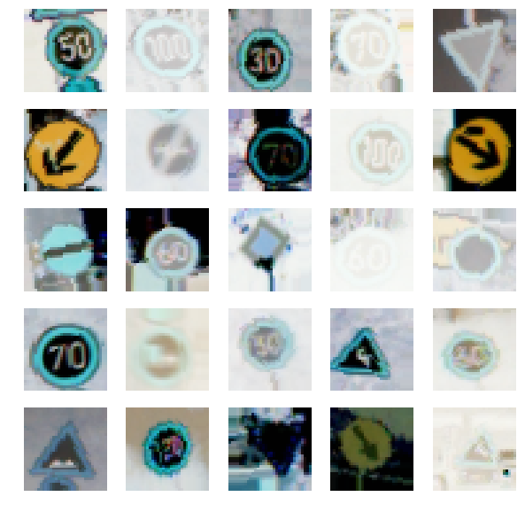
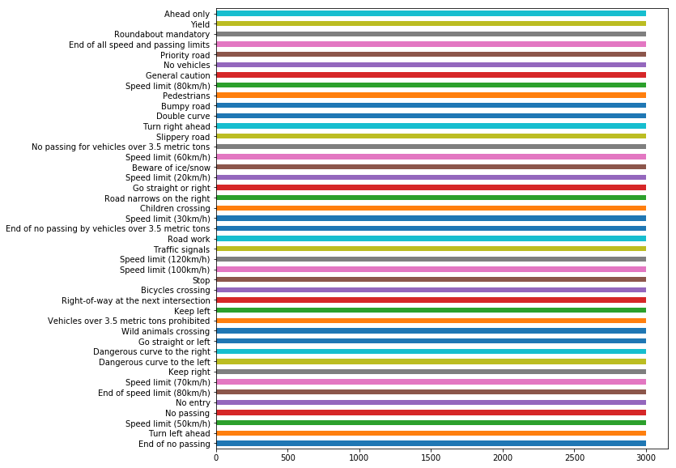
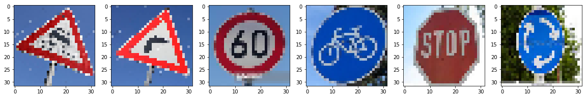
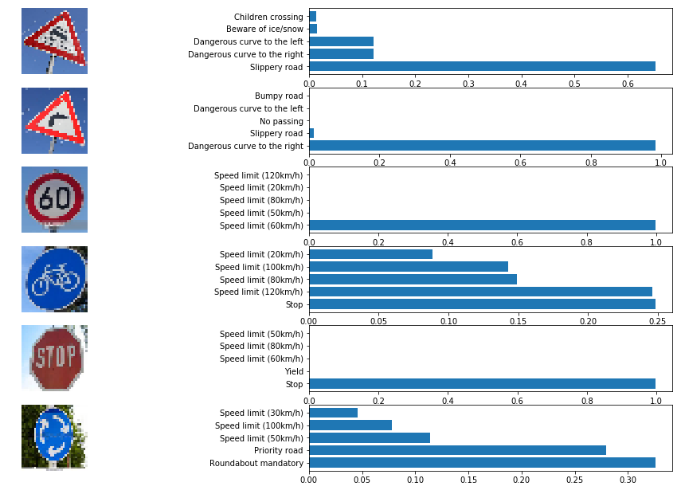
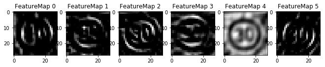

# **Traffic Sign Recognition** 

---

**Build a Traffic Sign Recognition Project**

The goals / steps of this project are the following:
* Load the data set (see below for links to the project data set)
* Explore, summarize and visualize the data set
* Design, train and test a model architecture
* Use the model to make predictions on new images
* Analyze the softmax probabilities of the new images
* Summarize the results with a written report

## Rubric Points

### Here I will consider the [rubric points](https://review.udacity.com/#!/rubrics/481/view) individually and describe how I addressed each point in my implementation.  

---
### Writeup / README

#### 1. Provide a Writeup / README that includes all the rubric points and how you addressed each one. You can submit your writeup as markdown or pdf. You can use this template as a guide for writing the report. The submission includes the project code.

You're reading it! and here is a link to my [project code](https://github.com/benjamintanweihao/CarND-Traffic-Sign-Classifier-Project/blob/master/Traffic_Sign_Classifier.ipynb)

### Data Set Summary & Exploration

#### 1. Provide a basic summary of the data set. In the code, the analysis should be done using python, numpy and/or pandas methods rather than hardcoding results manually.

I used the pandas library to calculate summary statistics of the traffic
signs data set:

* The size of training set is `34799`.
* The size of the validation set is `4110`.
* The size of test set is `12630`.
* The shape of a traffic sign image is `(32, 32, 1)`.
* The number of unique classes/labels in the data set is `43`.

#### 2. Include an exploratory visualization of the dataset.

Here is an exploratory visualization of the data set.

This is a sample of 25 traffic signs from the data set: 



This bar chart showing how the data is distributed across the classes:



It is clear that the data is not distributed uniformly. This will be addressed in the next section when data augmentation is discussed.

### Design and Test a Model Architecture

#### 1. Describe how you preprocessed the image data. What techniques were chosen and why did you choose these techniques? Consider including images showing the output of each preprocessing technique. Pre-processing refers to techniques such as converting to grayscale, normalization, etc. (OPTIONAL: As described in the "Stand Out Suggestions" part of the rubric, if you generated additional data for training, describe why you decided to generate additional data, how you generated the data, and provide example images of the additional data. Then describe the characteristics of the augmented training set like number of images in the set, number of images for each class, etc.)

As a first step, I decided to convert the images to grayscale because the ConvNet doesn't learn color. Rather, it learns edges and shapes. Instead, converting it to grayscale provides intensity data that is sufficient for the ConvNet to learn the kernels.

Each image goes through 2 preprocessing steps. The first is converting the image to grayscale. The second is to apply [Adaptive histogram equalization](https://en.wikipedia.org/wiki/Adaptive_histogram_equalization#CLAHE) to improve the contrast of the images. This is very useful to enhance parts of the images that might been taken in dark conditions or affected by too much light.

Here's an example of such an image that have undergone the 2-step preprocessing:



I decided to generate additional data because the classes are not represented equally.

To add more data to the the data set, I used the `ImageDataGenerator` from the `keras.preprocessing.image` package because it has a few convenient parameters that allow the generation of additional data. These are the settings that I used:

```python
datagen = ImageDataGenerator(horizontal_flip=False, 
                             vertical_flip=False,
                             width_shift_range=0.1,
                             height_shift_range=0.1,
                             zoom_range=0.1,
                             shear_range=0.1,
                             rotation_range=10.)
```

Here's an example of the images generated from `ImageDataGenerator`:
                             


Some of the images have been rotated, shared, zoomed, and translated. Note that horizontal flipping and vertical flipping has been turned off since some traffic signs depend on direction, such as "dangerous curve left or right". Also, this would not be a natural way to perceive a traffic road sign even in real world conditions.

The number of images that were generated per class depended on the number of images already present. If the class was underpresented then more images were generated. As a result of this data augmentation process, the total number of images per class are now equally distributed:




#### 2. Describe what your final model architecture looks like including model type, layers, layer sizes, connectivity, etc.) Consider including a diagram and/or table describing the final model.

The final model looks identical to the LeNet architecture with the exception of dropout layers.

My final model consisted of the following layers:

| Layer         		|     Description	        					| 
|:---------------------:|:---------------------------------------------:| 
| Input         		| 32x32x3 RGB image   							| 
| Convolution 5x5     	| 1x1 stride, valid padding, outputs 28x28x6 	|
| RELU					|												|
| Max pooling	      	| 2x2 stride,  outputs 14x14x6 					|
| Convolution 5x5	    | 1x1 stride, valid padding, outputs 10x10x16	|
| RELU					|												|
| Fully connected		| 400x120 (dropout: 0.75)						|
| Fully connected		| 120x84  (dropout: 0.75)						|
| Fully connected		| 84x43   (dropout: 0.75)						|
|						|												|
 


#### 3. Describe how you trained your model. The discussion can include the type of optimizer, the batch size, number of epochs and any hyperparameters such as learning rate.

To train the model, I used the ADAM optimizer, a batch size of `128`, and a learning rate of `0.001`. I set the number of epochs to `50`, but I terminate prematurely should the validation accuracy hit `97.8%`.

#### 4. Describe the approach taken for finding a solution and getting the validation set accuracy to be at least 0.93. Include in the discussion the results on the training, validation and test sets and where in the code these were calculated. Your approach may have been an iterative process, in which case, outline the steps you took to get to the final solution and why you chose those steps. Perhaps your solution involved an already well known implementation or architecture. In this case, discuss why you think the architecture is suitable for the current problem.

My approach was to use the original LeNet architecture used in the Lab. I started with colored images to establish a baseline. That attempt used around `65%` validation set accuracy. I then used grayscale images, and the results were more encouraging at around `94.9%`. After adding dropout, the network achieved around `96.3%` validation accuracy. Dropout here is useful because it introduces regularization which reduces overfitting, therefore potentially allowing the network to generalize better.

I then focused on further preprocessing the data, since I noticed that some of the grayscaled images were too dark. That's when I applied adaptive histogram equalization on the images. Further, I augmented the data set by supplying images that were slightly zoomed, shared, translated and rotated.

My final model results were:
* training set accuracy of `97.9%`
* validation set accuracy of `98.0%`
* test set accuracy of `95.3%`

This is a pretty good result, given that the training set accuracy is very close to the validation set accuracy. The model also does relatively well on the test set.

### Test a Model on New Images

#### 1. Choose six German traffic signs found on the web and provide them in the report. For each image, discuss what quality or qualities might be difficult to classify.

Here are six German traffic signs that I found on the web:



The first image might be difficult to classify because it is rotated, and also due to down-sampling, might confuse the network. In fact, the results show that his is the case.

#### 2. Discuss the model's predictions on these new traffic signs and compare the results to predicting on the test set. At a minimum, discuss what the predictions were, the accuracy on these new predictions, and compare the accuracy to the accuracy on the test set (OPTIONAL: Discuss the results in more detail as described in the "Stand Out Suggestions" part of the rubric).

Here are the results of the prediction:



The model was able to correctly guess 5 of the 6 traffic signs, which gives an accuracy of 83%. 

#### 3. Describe how certain the model is when predicting on each of the five new images by looking at the softmax probabilities for each prediction. Provide the top 5 softmax probabilities for each image along with the sign type of each probability. (OPTIONAL: as described in the "Stand Out Suggestions" part of the rubric, visualizations can also be provided such as bar charts)

The following is the code for making predictions on my final model:

```python
plt.figure(figsize=(18, 18))

for i in range(6):
    plt.subplot(10, 2, 2*i+1)
    plt.imshow(X_example[i])
    plt.axis('off')

    plt.subplot(10, 2, 2*i+2)
    plt.barh(np.arange(1, 6, 1), values[i, :])
    labels = [class_dict[str(ind)] for ind in indices[i]]
    plt.yticks(np.arange(1, 6, 1), labels)
```


For the first image, the model is relatively sure that this is a "slippery road" (probability of 0.6), which is indeed the case. The next highest probablities (0.1) are "dangerous curve to the left/right", which is understandable since the signs look pretty similar, especially when the images are down sampled.

The network is pretty sure about the second image of "dangerous curve to the right" (almost 1.0). As mentioned in the data augmentation section, being able to determine left and right is important, hence vertical and horizontal flipping was turned off when generating additional images.

The same goes for the third image of 60 km/h and the fifth image, the stop sign.

The bicycle crossing image is not present in the data set therefore the network has trouble detecting the image. A reason it thinks that the sign could be a stop sign could be due to the curves of the wheels looping like the curves of the wheel, and the vertical lines of the characters to look like the frame of the bicycle.

Finally the last image is categorized correctly as "roundabout mandatory". However, the network is not very certain about this. One reason could again be due to the curve of the arrows, which could mean a `0` present in the speed limit signs. The next highest probablity is "priority road", which is understandable since that sign has a square within a square, and here we have a circle of arrows within a circle.

### (Optional) Visualizing the Neural Network (See Step 4 of the Ipython notebook for more details)

#### 1. Discuss the visual output of your trained network's feature maps. What characteristics did the neural network use to make classifications?



The kernels that the network has learnt look like blurring, embossing, edge detection (in the horizontal and vertical direction), and a combination of these.


